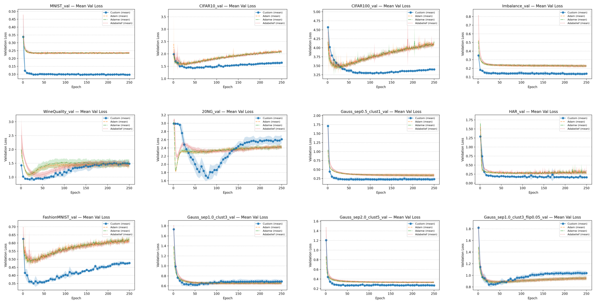

<!-- TL;DR – 10-line executive summary -->
**Diagonal-Hessian Optimizer 🏎️💨** 
[https://github.com/YunInSung/relu-based-2ndOrder-convergence](https://github.com/YunInSung/relu-based-2ndOrder-convergence)
A lightweight second-order method that guarantees global convergence using only the Hessian diagonal in ReLU/Leaky-ReLU MLPs.

- 📈 **60 % faster** than Adam, **−20 % val loss** on 7 datasets (MNIST, CIFAR-10/100, 20NG, …)  
- 📜 Formal **global linear convergence proof** under δ-bounded diagonal assumption  
- 🚀 Single-GPU friendly: pure TensorFlow 2.15 + XLA, no custom CUDA kernels  
- ⚙️ **Reproducible**:  
  ```bash
  pip install -r requirements.txt
  python experiment_runner.py
  ```
_(See the 🚀 Running Experiments → Command-Line Options section below for detailed options)_
- 🔍 Ablation: dropout 0.004 + label-smoothing 0.025 ⇒ best generalization  
- 🧪 **Quick Demo (Colab T4)**  
  [](https://colab.research.google.com/github/YunInSung/relu-based-2ndOrder-convergence/blob/main/demo.ipynb)


<p align="center">
  
</p>

# ⚙️ Diagonal Hessian Optimizer Experiments

*Custom Optimizer · Adam · AdamW · AdaBelief*

This repository includes the key scripts required to reproduce all experiments from "A Globally Convergent Second-Order Optimization Method Utilizing the Diagonal Hessian in ReLU-Based Models":

* `experiment_runner.py`: Runs the full suite of experiments
* `prepare_har.py`: Preprocesses the UCI HAR data
* `optimizer_sens_winequality.py`: Performs hyperparameter sensitivity analysis on WineQuality‑Red
* `plot_from_csv.py` / `plot_results.py`: Visualizes experimental results (CSV)
* `plot_optimizer_sensitivity.py`: Generates sensitivity heatmaps for the four optimizers

---

## 📋 System Requirements

* **OS**: Ubuntu 22.04 LTS
* **Python**: 3.9
* **CUDA**: 12.1 (nvcc V12.1.105)
* **cuDNN**: 9.9.0
* **TensorFlow**: 2.15.0 (XLA JIT enabled)
* **Main Libraries**

  ```text
  matplotlib==3.9.4
  numpy==1.26.4
  pandas==2.2.3
  scikit-learn==1.6.1
  tensorflow==2.15.0
  tensorflow-addons==0.22.0
  tensorflow-estimator==2.15.0
  tensorflow-io-gcs-filesystem==0.37.1
  tensorflow-probability==0.25.0
  ```

---

## 🛠 Installation

> **GPU vs. CPU**
> A CUDA‑compatible GPU (CUDA 12.1 + cuDNN 9.9) is strongly recommended for reasonable training times. If TensorFlow does not detect a GPU, the scripts automatically fall back to **CPU mode**, which can be **≈ 10× slower** for MNIST/CIFAR‑10 and substantially more for larger datasets.

```bash
git clone https://github.com/YunInSung/relu-based-2ndOrder-convergence.git
cd relu-based-2ndOrder-convergence

# Create and activate a virtual environment
python3 -m venv .venv
source .venv/bin/activate      # Windows: .venv\Scripts\activate

# Install dependencies
pip install --upgrade pip
pip install -r requirements.txt
```

---

## 📦 Data Download & Preprocessing

All scripts assume that data files are located at the project root.

| Dataset           | Filename                 | Download/Preparation Method                                                                              |
| ----------------- | ------------------------ | -------------------------------------------------------------------------------------------------------- |
| WineQuality-Red   | `winequality-red.csv`    | Download manually from the UCI ML Repository and place in the root directory                             |
| Credit Card Fraud | `creditcard.csv`         | Download the ZIP from Kaggle → unzip → copy `creditcard.csv` into the root directory                     |
| UCI HAR           | `UCI_HAR_Dataset.zip`,   | Download the ZIP → unzip → run `prepare_har.py` → generates NumPy files `har_X.npy`, `har_y.npy` in root |
|                   | `har_X.npy`, `har_y.npy` |                                                                                                          |

### 1. WineQuality-Red

```bash
# From the project root
wget -O winequality-red.csv \
  https://archive.ics.uci.edu/ml/machine-learning-databases/wine-quality/winequality-red.csv
```

### 2. Credit Card Fraud

1. Visit the [Credit Card Fraud Kaggle page](https://www.kaggle.com/datasets/mlg-ulb/creditcardfraud)
2. Click **Download** → download `creditcardfraud.zip`
3. Unzip and copy `creditcard.csv` to the project root

### 3. UCI HAR

```bash
# ➊ Download and unzip the original dataset
wget -O UCI_HAR_Dataset.zip \
  https://archive.ics.uci.edu/ml/machine-learning-databases/00240/UCI%20HAR%20Dataset.zip
unzip UCI_HAR_Dataset.zip -d ./UCI_HAR_Dataset

# ➋ Convert to NumPy
python prepare_har.py  # produces har_X.npy, har_y.npy in the root directory
```

---

## 🚀 Running Experiments

### A. Basic MLP Optimization Experiments

## Quick Start

```bash
python experiment_runner.py \
  --epochs 250 \
  --batch_size 128 \
  --num_repeats 7 \
  --hidden_layer_size 10 \
  --lr 0.001 \
  --weight_decay 1e-4 \
  --seed 42 \
  --batch_norm \
  --dropout_rate 0.004 \
  --label_smoothing 0.025 \
  --datasets MNIST CIFAR10
```

---

## Command-Line Options

| Flag                  | Type          | Default         | Description                                                                                                                                          |
| --------------------- | ------------- | --------------- | ---------------------------------------------------------------------------------------------------------------------------------------------------- |
| `--num_repeats`       | `int`         | `7`             | Number of times to repeat each experiment.                                                                                                           |
| `--hidden_layer_size` | `int`         | `10`            | Number of hidden layers in the MLP (excluding input & output layers).                                                                                |
| `--epochs`            | `int`         | `250`           | Number of training epochs per run.                                                                                                                   |
| `--batch_size`        | `int`         | `128`           | Mini-batch size for training.                                                                                                                        |
| `--lr`                | `float`       | `1e-3`          | Learning rate for baseline optimizers.                                                                                                               |
| `--weight_decay`      | `float`       | `1e-4`          | Weight decay coefficient (used by AdamW and AdaBelief).                                                                                              |
| `--seed`              | `int`         | `42`            | Random seed for reproducibility.                                                                                                                     |
| `--batch_norm`        | *flag*        | **ON**          | Enable Batch Normalization layers.                                                                                                                   |
| `--no_batch_norm`     | *flag*        |                 | Disable Batch Normalization layers.                                                                                                                  |
| `--dropout_rate`      | `float`       | `0.004`         | Dropout rate to apply after each hidden layer.                                                                                                       |
| `--label_smoothing`   | `float`       | `0.025`         | Label smoothing factor for cross-entropy loss.                                                                                                       |
| `--datasets`          | `list of str` | `MNIST CIFAR10` | Datasets to run (choose from: `MNIST`, `CIFAR10`, `CIFAR100`, `20NG`, `Imbalance`, `WineQuality`, `FashionMNIST`, `HAR`, `Gauss_sep0.5_clust1`, `Gauss_sep1.0_clust3`, `Gauss_sep2.0_clust5`, `Gauss_sep1.0_clust3_flip0.05`). |


> **Dataset note**
> Because XLA's static graph can balloon in size, each run is limited to **two datasets** at a time.
> By default the script trains on **MNIST** and **CIFAR‑10**.
> To include others (e.g., WineQuality, UCI HAR, synthetic Gaussians), add their names to `--datasets` or launch separate runs.

---

### Output files

After training finishes you will find:

* `logs/experiment_results.csv` – one‑row summary per dataset × optimizer
* `data/train/*.csv` – epoch‑vs‑**train loss** curves (optimizer × repeat)
* `data/val/*.csv` – epoch‑vs‑**validation loss** curves

These CSVs can be plotted directly with `plot_from_csv.py`.

### B. WineQuality-Red Sensitivity Analysis

The `optimizer_sens_winequality.py` script automatically evaluates performance across combinations of **dropout rate** and **label smoothing coefficient (α)** on the WineQuality-Red dataset:

```bash
python optimizer_sens_winequality.py
```

All parameter combinations defined in the script’s `ParameterGrid` are executed.

---

## 📊 Result Visualization

| Script                 | Input CSV Path                          | Output PNG Path                                                                                                                                   |
| ---------------------- | --------------------------------------- | ------------------------------------------------------------------------------------------------------------------------------------------------- |
| **plot\_from\_csv.py** | `data/train/*.csv` <br>`data/val/*.csv` | `figures/train_mean/*.png` <br>`figures/val_mean/*.png` <br>*Individual curves: `figures/train/`, `figures/val/` — uncomment in script to enable* |
| **plot\_results.py**   | `logs/experiment_results.csv`           | `figures/comparison_*.png` *(per metric)*                                                                                                         |

> Both scripts require no command‑line arguments.<br>Simply run `python plot_from_csv.py` or `python plot_results.py`.

| Logs Path                               | Description                                                                                                                                                            |
| --------------------------------------- | ---------------------------------------------------------------------------------------------------------------------------------------------------------------------- |
| `logs/full_sensitivity_summary.csv`     | Summary of val\_loss, val\_acc, val\_f1, and time for every combination of dropout rate, label smoothing (smooth\_alpha), number of hidden layers, optimizer, and run. |
| `logs/full_sensitivity_summary.parquet` | Same content saved in Parquet format                                                                                                                                   |
| `logs/full_sensitivity_histories.json`  | Full Keras history for each experiment run                                                                                                                             |
| `logs/val_loss_plots/*.png`             | Validation loss curves for each parameter combination × run                                                                                                            |

---

### E. Optimizer Sensitivity Heatmap

Use the `plot_optimizer_sensitivity.py` script to create validation loss heatmaps for the four optimizers (Custom, Adam, AdamW, AdaBelief):

```bash
python plot_optimizer_sensitivity.py
```

* **Required file**: `full_sensitivity_summary.csv` in the `logs/` folder
* **Output**: `figures/optimizer_sensitivity_heatmaps.png`

---

## 📂 Project Structure (Summary)

```
.
├── DNN.py
├── experiment_runner.py
├── plot_from_csv.py
├── plot_results.py
├── plot_optimizer_sensitivity.py
├── optimizer_sens_winequality.py
├── prepare_har.py
├── data/ …
├── figures/ …
├── logs/ …
├── requirements.txt
└── README.md
```

---

## ⚖️ License

This project is distributed under the **MIT License**.
